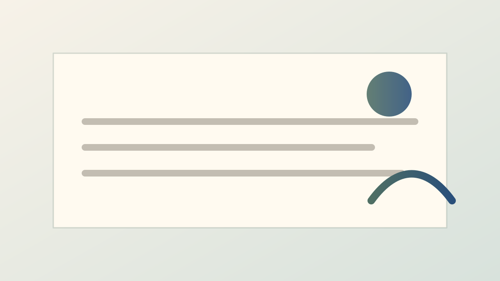

# Slidev Presentation Theme

---
title: Notes as Slides
subtitle: Default layout
---

# Notes as Slides

The theme works with ordinary Slidev Markdown and also understands markup emitted by `obsidian-slidev`.

- Source notes stay in the vault.
- Generated runtime files live under the Slidev workspace.
- The theme styles the generated `obsidian-slidev-*` classes.

  
Obsidian callout

  

    The plugin turns callouts into semantic HTML, and the theme owns the visual treatment.
  

Open a source note with <a class="obsidian-slidev-link" href="obsidian://open?vault=Vault&file=Notes%2FDeck.md">an Obsidian link</a>.

---
layout: two-cols
title: Media
subtitle: Generated assets
---

# Images

<figure class="obsidian-slidev-media obsidian-slidev-media--image">
  
  <figcaption class="obsidian-slidev-media__caption">Generated media keeps a predictable class structure.</figcaption>
</figure>

::right::

# Video and YouTube

<figure class="obsidian-slidev-media obsidian-slidev-media--youtube">
  <Youtube id="dQw4w9WgXcQ" />
  <figcaption class="obsidian-slidev-media__caption">YouTube links can render through Slidev's built-in component.</figcaption>
</figure>

---
layout: section
---

# Presets

The same markup can switch visual systems through `themeConfig.presentation.preset`.

---
title: UCAS preset
presentationPreset: ucas
---

# UCAS Is an Override

The default visual system is selected automatically. UCAS can be selected for institutional decks without changing the Obsidian integration contract.

  <strong>Slidev warning:</strong> unresolved links and missing assets stay visible instead of silently disappearing.

| Layer | Responsibility |
| --- | --- |
| `obsidian-slidev` | Convert vault notes into Slidev-native markup |
| `slidev-theme-4obsidian` | Render Slidev layouts, presets, and optional Obsidian semantics |

---
layout: center
---

# Next

Use the default preset for research reports, or select `ucas` and `ict` for institutional decks.
